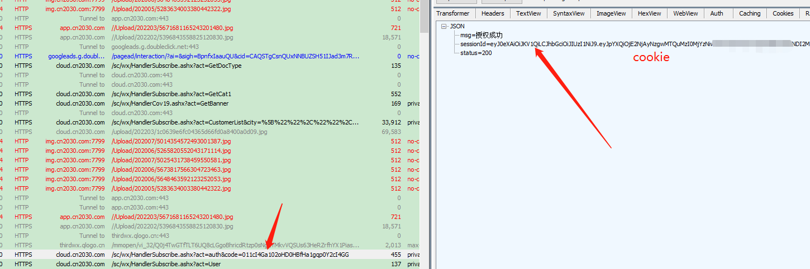
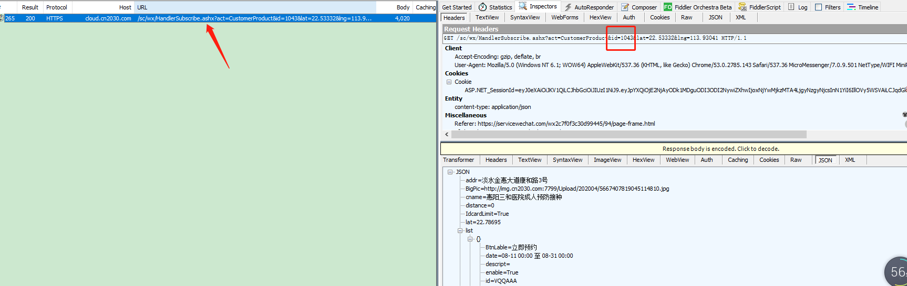
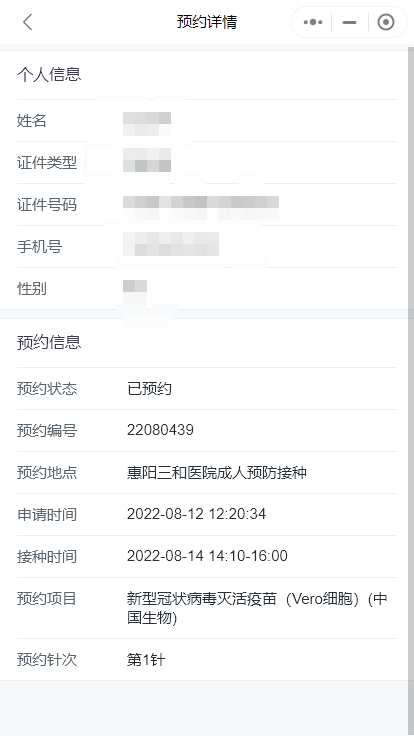

# 2022-08-28更新说明
* 开源代码(不带界面 感觉很鸡肋)  准备研究一下直接获取pid的方式 欢迎有想法的一起

# 2022-08-26更新说明
* 完善异常处理机制
* 修复打开fiddler就闪退的问题

# 2022-08-25更新说明
* 修复了大家issue提出的异常闪退问题
* 文本日志输出优化 更容易看出是哪里出现了问题
* 更新动态刷pid流程(推荐大家直接填疫苗全名) 提高获取速度

# 2022-08-14 更新说明
* 修复因超时闪退问题
* 支持疫苗名字全匹配定位(最好使用这种方式 相当于复制一下疫苗名字)

# 2022-08-13 更新说明
* 关于issue不会使用fiddler的小伙伴们  fiddler使用方法 [使用说明](https://blog.csdn.net/A_Liucky_Girl/article/details/124534772) 
* [关于fiddler无法抓取小程序包问题解决方案](https://blog.csdn.net/weixin_45507369/article/details/124204625) 

# 使用说明

* cookie: 知苗易约小程序cookie 获取预约人信息

* 医院id: 需要预约医院的id

* tags: 由于现在疫苗的id是动态生成的 这里做了个标签快速定位到含有标签的疫苗 用 "," 分隔  例如: 九价,16-26

* 查询延时和下单延时 暂时固定了为 1ms

# cookie和医院id获取方式：

* 抓包工具fiddler下载地址: [fiddler抓包工具](https://www.telerik.com/download/fiddler-everywhere)
* cookie获取方式
* 医院id获取方式 
    

### 示例图

# 注意事项
* **一般来说使用工具抢苗需要提前打开 因为要刷苗 防止错过**
* **由于我没有9价的号源地测试 所以此工具并非100%能帮助大家抢成功(在这里我希望大家都可以成功 )**
* **以上cookie的有效时长为1小时 另外我试过预约成功后的cookie会再次使用提交会201 如果在订单提交返回201的情况下 试试换一下cookie**
* **目前今天2022-08-12 我测试过还能正常预约**
* **最后祝愿女孩子都能抢到 男孩子都能帮女朋友抢到**
* **有需要学习的可以issue来一下 创作不易希望大家喜欢(喜欢就动动手吧)**
* **最最最最最重要的事情  请勿将此工具用于非法用途 不要乱来!!!!!!!!!!!! 谢谢大家 这里我就不放源码了**

# 鸣谢

* 这里要感谢一下[liuzhijie443](https://github.com/liuzhijie443/ZhiMiao_JiuJia) 大佬提供的思路